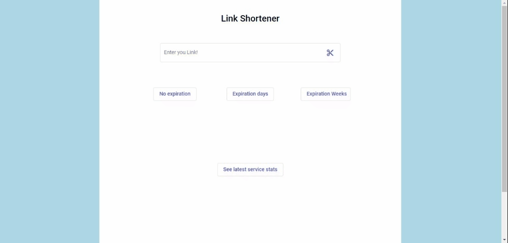

# ShortLinkFrontend

- Run `ng serve` for a dev server. Navigate to `http://localhost:4200/shortener` to access application.

### Copy the link you wish to shorten in the input field and click the button to receive a shortened link.

### You can copy the received short link manually and use it right away.

### You can also use the copy button right next to the received short link to copy the link to your clipboard.

### When you click the `see latest service stats` button at the bottom, you will see statistics on how many short links are saved by this service right now and how many times saved links have been used. 

